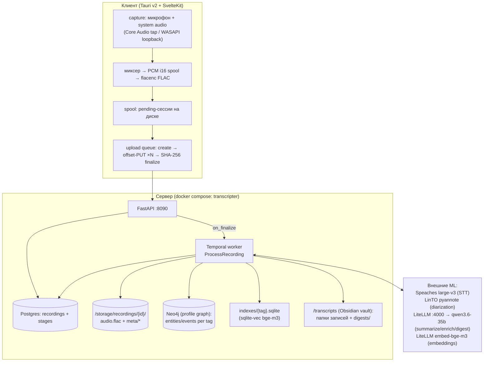

# LOGIC_DIAGRAM.md — как Transcripter работает изнутри

Полная карта логики: от нажатия «записать» на клиенте до графа знаний,
дайджеста по тегу и семантического поиска. Каждая стадия: что принимает,
что извлекает, что дедуплицирует, что и куда пишет, что может упасть.

---

## 0. Картина целиком (одна диаграмма)



Два направления данных:

1. **Запись вниз по воронке** — аудио превращается в артефакты
   (транскрипт → саммари → граф).
2. **Память вверх по воронке** — уже построенные структуры
   (дайджест тега, семантический индекс, известные сущности графа)
   подмешиваются в промпты следующих записей.

---

## 1. Клиент: захват, спул, загрузка

### 1.1 Захват (`src-tauri/src/recording.rs`, `capture*.rs`)

- Два источника: **микрофон** (обязательный) и **system output**
  (опциональный; macOS 14.2+ — Core Audio process tap,
  Windows — WASAPI shared-mode loopback).
- Pre-flight (`cmd_pre_flight`) открывает и пробует каждый выбранный
  источник **до** старта. Не запустившийся system-источник блокирует
  запись; режим «только микрофон» доступен, только когда System audio
  явно выключен.
- Миксер (`spawn_mixer`) складывает потоки сэмплов в один моно-поток и
  пишет **сырой interleaved i16 PCM** в `<id>.pcm` на диск (RAM плоская,
  запись переживает часы работы).
- Семантика стартовых таймаутов — не симметрична:
  - микрофон не дал первый сэмпл за **1 с** (`MIC_START_TIMEOUT`) →
    запись **фатально** прерывается;
  - system audio молчит **10 с** (`SYSTEM_START_TIMEOUT`) →
    запись продолжается только с микрофона, UI получает
    `cmd_recording_degraded` (тап выдаёт сэмплы, только когда звук реально течёт).

### 1.2 Финализация записи (`encode.rs`, `recording.rs stop`)

- `FlacWriter.finish`: PCM-сайдкар → валидный FLAC (flacenc,
  fixed block size 4096, STREAMINFO с md5 и total samples), сайдкар удаляется.
- Канонический формат: **48 кГц mono FLAC** (вся система дальше считает
  именно его).
- Сессия ложится в **spool** (`spool.rs`): папка `<spool>/<id>/` с
  `audio.flac` и `session.json` (title, tags, duration, server_rec_id —
  может быть уже присвоен при частичной загрузке).

### 1.3 Загрузка (`uploader.rs`, очередь в `lib.rs`)

Один глобальный очередной воркер (mpsc), сессии идут **строго
последовательно**; `QUEUED: HashSet` не даёт задвоить одну сессию между
stop-путём и `cmd_retry_pending`.

Протокол на сессию:

1. `POST /recordings` (title, tags, total_bytes) → `id` (если spool-сессия
   ещё не знает `server_rec_id`; ответ персистится в `session.json`).
2. `GET /recordings/{id}` → `committed_bytes` = точка возобновления.
3. Цикл `PUT /recordings/{id}/audio?offset=N` кусками по **8 МиБ**;
   ответ `{committed}` — новая точка. Серверный максимум за раз — 16 МиБ.
4. `POST /recordings/{id}/finalize {sha256, duration_sec}`:
   - сервер считает SHA-256 по полученному файлу; несовпадение → 409;
   - проверка `has_audio_frames` (FLAC без единого аудио-фрейма →
     422 и запись помечается failed сразу, ретраи бесполезны);
   - состояние `processing`, вызов `on_finalize` → старт Temporal-воркфлоу.
5. Только после ack загрузки spool-сессия чистится. Ошибки делятся на
   permanent (401/409/422 — ретраить бессмысленно) и transient
   (сеть, 5xx, 408/429 — остаются pending, `cmd_retry_pending`
   перезапускает).

**Альтернативный путь** — `POST /recordings/direct` (multipart, Android и
страница Import): файл льётся одним запросом; если байты не FLAC —
ffmpeg перекодирует в 48kHz mono FLAC на сервере. Поля формы:
`title`, `tags` (JSON-строка), `duration_sec`, `type`, `recorded_at`
(бэкдейт для импорта — ляжет в `recorded_at` и задаст дату папки/таймлайна).
Те же guard'ы: 400 пустой файл, 507 мало места, 422 тишина; при любой
ошибке после создания — строка и каталог сносятся начисто.

### 1.4 Клиентский UI

- Список (`recordings/+page.svelte`): пагинация по 20, `q`/state фильтры
  на сервере, поллинг каждые 3 с, монотонный request-id против гонок.
- Деталь записи (`recordings/[id]/+page.svelte`): поллинг пока
  `state == processing`; вкладки артефактов transcript / speakers /
  events / summary / json — ленивая загрузка через
  `GET /recordings/{id}/artifacts/{stage}`; PATCH title/tags/type;
  регенерация стадий; удаление; poll дайджеста по таймауту.
- Vault (`vault/+page.svelte`, `vault/[tag]/+page.svelte`): обзор тегов,
  таймлайн, дайджест (202 → poll до появления), переименование сущностей,
  семантический поиск.

---

## 2. Хранилища и канонические артефакты

### 2.1 Postgres (`worker/db.py`)

- `recordings`: `id` (uuid), `title`, `tags` (TEXT[], нормализованные:
  trim + lowercase + дедуп с сохранением порядка), `type` (slug типа —
  ключ маршрутизации профилей), `state`
  (`uploading|processing|done|failed`), `sha256`, `duration_sec`,
  `recorded_at` (бэкдейт импорта), `created_at`, `committed_bytes`.
- `stages`: по строке на стадию — `kind` ∈
  `chunk, transcribe, diarize, merge_speakers, summarize, enrich`,
  `status` ∈ `pending|running|done|failed|skipped`, `attempts`,
  `last_error`, `details` (JSON — полезная нагрузка: язык, число
  сегментов, спикеры, recap-индикатор, namespace'ы…).

### 2.2 Файловое дерево записи (`/storage/recordings/{id}/`)

```
audio.flac                     ← канонический вход
meta/
  chunks/                      ← chunk-стадия (chunk.enabled=true)
    chunks.json                ← манифест: граница crash/resume
    chunk_000.flac ...         ← FLAC-части (удаляются после merge)
    chunk_000.segments.json    ← per-chunk STT (resume-результаты)
    chunk_000.diarization.json ← per-chunk diarization
  segments.json                ← слова+сегменты с таймстампами (transcribe)
  transcript.md                ← человекочитаемый транскрипт
  diarization.json             ← сегменты спикеров (diarize)
  diarized-transcript.md       ← реплики по спикерам (merge_speakers)
  summary.md                   ← саммари (summarize; canonical имя)
  events.json                  ← таймлайн-артефакт enrich (контракт UI)
```

### 2.3 Vault (`TRANSCRIPTS_DIR`, в контейнере `/transcripts`)

```
{YYYY-MM-DD_HH-MM} {title} {id8}/   ← папка на запись (export)
  transcript.md                     ← frontmatter + тело
  diarized-transcript.md            ← если merge отработал
  summary.md | {output_artifact}    ← имя может переименовать профиль
digests/{slug}.md                   ← заметка-дайджест на тег
indexes/{slug}.sqlite               ← семантический индекс на тег (vec0)
```

Сентинел `.transcripter` в корне: без него экспорт отказывается писать
(защита от записи в пустой маунтпойнт до поднятия NFS).

### 2.4 Neo4j (compose-профиль `graph`, bolt://neo4j:7687)

- **Узлы-Entity**: `{tag, slug, label, type, origin_recording_id,
  first_seen_recording, recording_ids[], embedding?, user_corrected?}`
- **Узлы-Event**: `{tag, origin_recording_id, ts, kind, summary,
  recording_date, recording_title}`
- **Рёбра**: `(Event)-[:MENTIONS]->(Entity)`,
  `(Entity)-[:REL {type}]->(Entity)`.
- **Namespace = значение свойства `tag`** — НЕ отдельная БД/метка.
  Все записи со всеми тегами живут в одной базе; тег — это фильтр.
- Векторный индекс `embedding_bge_m3` (1024-d, cosine) поверх
  `Entity.embedding`; самосоздаётся (`IF NOT EXISTS`) при первой записи
  с эмбеддингами.

---

## 3. Temporal: воркфлоу и гарантии

### 3.1 `ProcessRecording` (воркфлоу на запись)

Порядок жёсткий: `chunk → transcribe → diarize → merge_speakers →
summarize → enrich`. Запуск с `start_stage` пропускает стадии выше
(это и есть механика regenerate: `idx = order.index(start)`,
условия `if idx <= k`).

Retry-политики:

| Стадия | StartToClose | Retry | Почему |
|---|---|---|---|
| chunk | `2×duration+300с` | ×2 | дёшево (ffmpeg) |
| transcribe | `_ml_budget` | **×1** | минуты CPU-вычислений на shared-стеке; ретрай = повторный прогон всего |
| diarize | `_ml_budget` | ×3, медленный backoff | LinTO грузит веса ~2 мин после старта профиля |
| merge_speakers | 120с | ×2 | чистая локальная работа |
| summarize | 2400с | **×1** | бюджет прибит к потолку LiteLLM-прокси |
| enrich | 2400с | ×3, backoff 5 мин | дренирование FIFO-очереди прокси |

`_ml_budget` — `base(300с) + 40с×минуты`, при чанкинге суммируется
по чанкам; heartbeat 120 с (worker бьёт каждые 60 с через
`_heartbeat_while`).

Best-effort-стадии — `diarize`, `merge_speakers`, `enrich`
(`BEST_EFFORT_STAGES`): их `failed` не валит запись. Workflow ловит
`ActivityError` на diarize/enrich, `finalize_recording` ставит
`done`, если упали только они; `failed` — если упала опорная стадия
(chunk/transcribe/summarize).

`finally` всегда: `finalize_recording` (терминальное состояние) +
`export_transcript` (экспорт в vault; `WAIT_CANCELLATION_COMPLETED`,
ошибки возвращаются значением, а не исключением).

### 3.2 Второстепенные воркфлоу

- `ExportRecording` — отдельный экспорт (rename/PATCH-пути).
- `TagDigest` — одна активность `tag_digest` (Postgres + Neo4j + LLM +
  атомарная запись заметки), 2400 с, без авторетраев.
- `GraphGc` — свип графа по расписанию (Temporal Schedule
  `graph-gc`, регистрируется при `graph.gc_interval_sec > 0`,
  overlap `CANCEL_OTHER`).
- `RenameEntity` — одна активность переименования сущности (120 с, ×2).

Все воркфлоу и активности регистрируются явными списками в
`worker/main.py` (`ACTIVITIES`) — `@activity.defn` без записи в списке =
NotFoundError в рантайме со стадией, висящей в pending.

---

## 4. Стадия `chunk` — зачем нарезка и как не потерять швы

**Проблема, которую решает**: на длинных записях (90 мин — норма,
2.5 ч — максимум) whisper на CPU-стеке впадает в repetition loop
(одна фраза бесконечно) и портит весь транскрипт. Чанкинг сбрасывает
контекст декодера каждые N минут → портится максимум один чанк.

- `plan_chunks(duration, target_min=10, overlap_sec=2)`:
  окна `(start, end)` с шагом `target − overlap`; соседи делят
  2-секундную полосу. Микрохвост `< 2×overlap` поглощается
  предыдущим чанком (иначе его keep-window пуст, и конец записи молча
  исчезал бы из транскрипта — поймано на живой записи).
- `cut_chunks` перерезает **с нуля** при regenerate (старые файлы и
  статусы сбрасываются), ffmpeg per chunk, таймаут 120 с.
- Манифест `chunks.json` (`Manifest`) — атомарная запись
  (tmp+os.replace) после **каждого** чанка. Поля чанка: `index, file,
  start, end, transcribe: pending|done, transcribe_suspect,
  diarize: pending|done`. Это граница resume: регенерация transcribe
  доходит только по не-done (или suspect) чанкам.
- `keep_window(index, total, len, overlap)`: первая половина общей
  полосы принадлежит левому чанку, вторая — правому
  (`lo = overlap/2` для не-первых, `hi = len − overlap/2` для
  не-последних). Каждое мгновение аудио — ровно у одного чанка:
  ни дублей, ни дырок на швах.
- `shift_into(items, chunk_start, lo, hi)`: переносит сегменты/слова
  чанка на глобальную шкалу, оставляя те, чей **середина** внутри
  keep-window.
- `is_suspect(texts)`: если ≥4 сегментов и >50% — одинаковый
  нормализованный текст → чанк подозрителен (repetition loop);
  при следующем запуске он пересжимается с `reset_context`
  (prompt пустой, контекст декодера обнулён).

Дальше все стадии, если манифест есть, идут **по чанкам последовательно
— никогда параллельно**: shared CPU voice-стек под параллельными
large-v3-джобами проседает вдвое (инцидент 2026-08-25).

---

## 5. Стадия `transcribe` — аудио → слова с таймстампами

- Бэкенд: `api` (Speaches, `Systran/faster-whisper-large-v3`, OpenAI-
  совместимый `/audio/transcriptions`, verbose JSON со словами) или
  `local` (faster-whisper в контейнере worker, модель прогревается на
  старте через `preload_local`).
- Per-chunk ретраи **внутри** активности: 2 попытки, backoff 5 с
  (Temporal-политика здесь ×1, чтобы ретрай не перезапускал все чанки).
  Персистентный фейл → стадия `failed` с координатами чанка; regenerate
  догонит только не-done.
- Детектор loop'а: `transcribe_suspect` выставляется сразу после чанка
  (см. §4) — в деталях стадии видно `suspect_chunks`.
- Выход: `segments.json` (язык, сегменты, слова с таймстампами) +
  `transcript.md` (строки `**[HH:MM:SS – HH:MM:SS]** текст`).
  Язык берётся первый не-`unknown` по чанкам.
- Бюджеты: HTTP-клиент на 30 с **под** Temporal-таймаутом — httpx
  ReadTimeout (обычное исключение → стадия failed) срабатывает раньше,
  чем Temporal отменит активность (CancelledError обходит
  `except Exception` и оставил бы стадию в running навсегда).

---

## 6. Стадия `diarize` — кто когда говорил

- HTTP POST аудио-файла в LinTO (`linto-diarization-pyannote`, CPU),
  ответ `seg_begin/seg_end/spk_id` транслируется в `start/end/speaker`
  на границе (`diarize.py`) и нигде больше.
- Тоже chunked + per-chunk персист + resume. **Speaker-метки per-chunk**:
  `spk_0` в чанке 1 — не тот же `spk_0` в чанке 2. Осознанно принято:
  merge приписывает слова по временному перекрытию, ему достаточно
  локальных меток.
- Выход `diarization.json`. Стадия best-effort: фейл не роняет запись
  (транскрипт без спикеров всё равно полезен); перед запуском старый
  файл удаляется, чтобы merge не съел протухший результат.
- Выключено конфигом (`diarization.enabled: false`) → skipped +
  удаление `diarization.json` и `diarized-transcript.md` (никакой
  протухшей атрибуции).

## 7. Стадия `merge_speakers` — слова + спикеры → реплики

`merge.py`:

1. Каждое **слово** получает спикера диаризационного сегмента с
   **максимальным перекрытием** по времени. Если перекрытия нет вообще —
   ближайший сегмент по расстоянию между центрами.
2. Подряд идущие слова одного спикера склеиваются в **turn** (реплику):
   смена спикера → flush.
3. Выход: `diarized-transcript.md`
   (`**spk_1 [00:01:23 – 00:01:41]:** текст`) — одновременно и
   человекочитаемый артефакт, и **источник сегментации** семантического
   индекса (§10), и артефакт экспорта.

Без диаризации (файла нет или `segments` пуст) → skipped + чистка
старого артефакта. После merge — `cleanup_chunks`: FLAC-чанки удаляются
(retention `until_merged`), манифест и per-chunk JSON остаются
(диагностика + ресклейка без повторного STT). Поэтому regenerate с
transcribe после merge честно говорит: «чанки удалены, начинай с chunk».

---

## 8. Стадия `summarize` — транскрипт → саммари (с памятью)

`activities.summarize` → `summarize.py`:

1. **Профиль**: `match_profile_by_type(rec.type, profiles_dir)` —
   профили перечитываются с диска на каждый запуск (рестарт не нужен).
   Есть профиль → его `summarize.prompt` (системное сообщение — фиксированное
   «Follow the user's instructions.»); нет — встроенный промпт.
2. **Подстановка**: ТОЛЬКО литеральные `.replace("{title}", …)` и
   `.replace("{transcript}", …)`. Никакого `str.format` — фигурные
   скобки JSON-примеров в промптах профилей безопасны (это был реальный
   баг: KeyError на схемах с `{}`).
3. **Recap (память серии)**: если `summarize.recap` и граф включён и у
   записи есть теги — `build_recap(tags[0], …)`:
   - тело заметки `digests/{tag}.md` (без frontmatter, обрезка 4000 символов);
   - **плюс retrieval-хвост** (`_related_earlier_discussion`):
     - запрос = **первое окно** транскрипта текущей записи (в начале
       обычно повестка — она и находит релевантные старые обсуждения);
     - KNN по `indexes/{slug(tag)}.sqlite`, **over-fetch 200**;
     - исключение текущей записи **после** KNN (на regenerate её
       окна сидят в индексе с дистанцией ~0; узкий over-fetch вернул
       бы только её саму — поймано живьём: 818 сегментов, k×4=24 → 0
       хитов; отсюда фиксированные 200);
     - не больше **2 хитов на одну старую запись** (длинная сессия не
       съест весь блок), суммарно `recap_k=6`, бюджет 1600 символов,
       каждый хит ≤420 символов;
     - блок: `• «title» @ 12:34: текст…`.
   - Любой фейл retrieval'а — дайджест-only; нет ни дайджеста, ни хитов
     — промпт без prior-контекста. Никогда не роняет стадию.
4. LLM-вызов: `cfg.summarize` (LiteLLM :4000, `qwen3.6-35b-a3b-q4_k_m`),
   2400/2370 бюджеты, `system_first_messages` (инвариант: ровно одно
   system-сообщение первым — шаблон llama-server иначе 500).
5. Выход: `meta/summary.md` (каноническое имя всегда; в vault-папке
   профиль может переименовать через `output_artifact`).
   В `details` — `recap {used, sessions: 0, chars}` (индикатор «Memory
   applied» для UI).

---

## 9. Стадия `enrich` — транскрипт → граф знаний (самая сложная)

`activities.enrich` → `enrich.py`. Best-effort: её фейл/скип не портит
запись. Скипы — non-retryable `ApplicationError` (честный `skipped`
вместо «успеха»): (a) граф выключен (`graph.uri` пуст), (b) профиль
матчнулся, но `enrich:`-секции нет (автор отказался осознанно),
(c) профиль не матчнулся и `graph.enrich_all` выключен.

### 9.1 Извлечение (extraction)

1. **Промпт**: `profile.enrich.prompt` (или встроенный
   `_FALLBACK_ENRICH_PROMPT` при `enrich_all` — минимальная онтология:
   person/org/project/place/thing + milestone/change/decision/meeting).
2. **`{known_entities}`**: если профиль включил `known_entities`
   (true→25, число→N), до извлечения читается снапшот **первого**
   namespace'а: top-N сущностей по числу `recording_ids` (чем чаще
   упоминалась в других записях, тем выше), **исключая узлы самой
   записи** (regenerate не должен подсматривать в то, что сам сейчас
   снесёт). Рендер: `- slug — label (type)`; пусто → **пустая строка**
   (литерал `(none)` заставлял qwen3.6-35b детерминированно ломать JSON
   — поймано 2026-08-30). Снапшот один, а не на каждый тег: извлечение —
   ОДИН LLM-вызов, повторять его на каждый namespace = умножить цену на
   число тегов.
3. **Один HTTP-вызов** с `response_format: json_object` — модель
   обязана выдать JSON-объект. До 3 попыток на не-JSON/5xx/таймаут.
   Контракт формы залочен: `{"events": [{ts, kind, summary, entities?}],
   "entities": [{slug, label, type}], "relations": [{from_slug,
   to_slug, type}]}` — отсутствующие ключи = пустые списки.
4. **Коэрсинг** (`_parse_extraction`): entities первыми (их slug'и —
   допустимое множество для mentions); мусорные элементы отбрасываются
   по одному, без падения всей стадии:
   - entity: `label` обязателен; `slug` из поля или из label;
     `type` → "unknown"; всё через `slugify`;
   - event: `ts`/`kind`/`summary` обязательны; `entities: [...]` —
     slugify + дедуп + **отфильтровать неизвестные slug'и** (упоминание
     неизвлечённой сущности не может стать ребром);
   - relation: `from_slug`/`to_slug` обязательны; `type` → "related".
   - `slugify`: casefold → `\W+` → `-` → collapse → strip; юникод
     (\w держит кириллицу — иначе все русские метки схлопывались в
     "unknown" и сливались в один MERGE-ключ); пусто → "unknown".

### 9.2 Дедупликация (resolve_slugs) — сердце логики

Идёт **отдельно для каждого namespace'а** (теги — независимые миры).
Два уровня + три механизма решения:

**Уровень 0 — мягкий гейт** (`dedup_llm_gate`): один зонд-Y/N (30 с)
с backoff 60/120 с, максимум 3. Извлечение (2400 с) и Y/N-дедуп сидят в
одной FIFO-очереди LiteLLM — когда очередь голодная, мелкие вызовы
таймаутят все разом, и «серая зона» мержится как "same" по ошибке
(инцидент Phase 3-F). Гейт не прошёл → LLM-нога дедупа выключается
целиком, остаётся только эмбеддинг-префильтр, серая зона мержится
как "same" — ровно та семантика, что сегодня даёт ошибка per-call.

**Уровень 1 — дешёвый**: группировка по slug. Первый в группе —
канонический, остальные — кандидаты на дубль. Плюс `ExistingEntityLookup`
подмешивает коллизии с **живым графом**: `MATCH (e {tag, slug})` с
исключением узлов текущей записи (`origin_recording_id <> $rec`) — это
делает regenerate идемпотентным: свои старые узлы не считаются занятыми,
перезаписанные slug-суффиксы возвращаются на место вместо дрейфа
`-2 → -3 → -4`.

**Уровень 2 — вердикт на пару** (`_dedup_verdict`):

```
                    ┌─ user_corrected узел? ── да ─→ distinct (никогда не мержить)
коллизия (slug) ──► │
                    └─ same_entity_decision:
                        оба вектора есть?
                        cosine ≥ 0.90 (tau_high) → same     (без LLM)
                        cosine ≤ 0.75 (tau_low)  → distinct (без LLM)
                        0.75 < cos < 0.90        → серaя зона ↓
                        вектора нет              → ↓
                    серaя зона / нет векторов:
                        gate выключил LLM? → same
                        иначе → ask_same_entity (LLM Y/N, 30 с):
                          ошибка/невнятный ответ → same (best-effort)
                          Y → same (кандидат выпадает, сливается с каноником)
                          N → distinct (кандидат переслаживается)
```

- Эмбеддинги лейблов считаются **одним батчем** на всё извлечение
  (позиционно, в порядке entities); вектор живого узла читается из его
  свойства `embedding`. Реализация — `embed_texts` (единая точка:
  локальный ONNX bge-m3 int8 или HTTP `/embeddings` LiteLLM — по
  `graph.embed.backend`).
- `ask_same_entity`: промпт «Existing … New … same real-world entity?
  Y or N», парсинг лояльный (Y/yes/true/same/да/是的 vs N/no/false/
  different/нет/不 — первое слово до пунктуации). **Ошибки и невнятное
  → True**: хлипкая LLM не должна плодить дубли в графе. Бюджет 30 с,
  а не 2400 — зависший llama-server не стоит таймаута активности.
- **Разрешение**:
  - same → кандидат выбрасывается; `remap[orig_slug] = slug_каноника`
    (рёбра перевешиваются);
  - distinct внутри извлечения → `_disambiguate`: `-2`, `-3`, …
    пока не свободно в этом извлечении;
  - distinct против графа → `_next_free_slug`: `-2`, `-3`, … пока не
    свободно **и** локально, **и** в живом графе (исключая свои узлы).
- После цикла все relations перевешиваются через `remap`
  (pre-resolution slug → финальный slug).

### 9.3 Запись в граф (`write_to_graph`) — одна транзакция на namespace

```cypher
-- 1. purge (только первый namespace, purge_origin=True):
MATCH (n {origin_recording_id: $rec})
WHERE coalesce(n.user_corrected, false) = false
DETACH DELETE n                      -- все namespace'ы разом, свой rec

-- 2. сущности:
MERGE (e:Entity {tag: $tag, slug: $slug})
ON CREATE SET e.label=…, e.type=…, e.origin_recording_id=$rec,
              e.first_seen_recording=$rec, e.recording_ids=[$rec],
              e.embedding=$embedding          -- только если вектора дали
ON MATCH  SET e.label = CASE WHEN user_corrected THEN e.label ELSE $label END,
              e.type  = …то же…,
              e.recording_ids = CASE WHEN $rec IN recording_ids
                                     THEN recording_ids
                                     ELSE recording_ids + $rec END

-- 3. события: CREATE (не MERGE — события записи уникальны по построению,
--    а purge выше заменяет старую пачку)

-- 4. рёбра: MERGE (Event)-[:MENTIONS]->(Entity) и
--    MERGE (Entity)-[:REL {type}]->(Entity)
```

Ключевые инварианты:

- **Идемпотентность = DETACH DELETE по свойству** `origin_recording_id`
  (не по тегу!): повторный прогон той же записи даёт то же состояние,
  а **правка тегов между прогонами не оставляет сирот** — первая запись
  чистит копии записи во **всех** namespace'ах разом; вызовы 2..N идут
  с `purge_origin=False`.
- `user_corrected` узлы выживают любой regenerate: их не удаляет purge,
  ON MATCH их не перетирает — правка пользователя («Валли» → «Валя»)
  авторитетна (Phase 4). Dedup их тоже не мержит (§9.2).
- `MERGE (tag, slug)` — единственный канал мультисессионности: одна и та
  же сущность из разных записей сливается в один узел, `recording_ids`
  копит provenance (дайджест читает его, а не `origin_recording_id`).
- Эмбеддинг пишется **только ON CREATE**: повторное появление сущности
  не меняет идентичность → не перезаписывает вектор.
- Всё параметризовано; метки узлов из профиля валидируются регэкспом
  Cypher (`_safe_label`); строки с `{}` в f-string'ах соблюдены
  (живой гард — `graph_probe.py`).
- MENTIONS-рёбра и `mentions` в `events.json` считаются **одной
  функцией** `_event_mentions`: объявленные моделью `entities: [...]`
  в приоритете; иначе эвристика — label сущности встречается в summary
  события как целое слово (word-boundary, case-insensitive; «Orc» не
  сматчится на «Orcus»). Артефакт и граф не могут разойтись.

### 9.4 Артефакт `meta/events.json` (Phase 1 контракт UI)

Пишется **после** графа (файл не опишет узлы, которых не закоммитили),
атомарно, из **первого** namespace'а (копии идентичны):

```json
{"recording_id", "recording_date", "recording_title", "profile_id",
 "namespaces": ["tag1", ...],
 "events": [{"ts","kind","summary","mentions": [slug,...]}],
 "entities": [{"slug","label","type"}],
 "relations": [{"from","to","type"}]}
```

Поверх — **user-corrected overlay** (`user_corrected_labels` читается
ДО purge-capable записи): лейблы в артефакте заменяются на
пользовательские, чтобы таймлайн не воскрешал ASR-угадайку после
переименования.

### 9.5 Авто-дайджест (Phase 2)

После **успешного** enrich: для каждого тега, если `digests/{tag}.md`
старше `graph.auto_digest_window_sec` (3600 с) или отсутствует —
inline `run_digest(tag, last_n=5)` (не сигнал — так дайджест гарантированно
видит только что записанный граф). Ошибки логируются, стадию не валят.

---

## 10. Семантический индекс (Phase 3.5) — `indexes/{tag}.sqlite`

Запускается в конце enrich для **каждого** тега записи (копии, как
граф). Best-effort: упавший эмбеддер = `indexed_segments: 0` в details.

- **Сегментация** (`segment_transcripts`): приоритет — реплики
  `diarized-transcript.md` (спикер + таймстампы, если была диаризация);
  иначе скользящие окна поверх `transcript.md`: ~300 токенов
  (эвристика 0.75 слова/токен), шаг ~50 токенов, сегменты не режутся —
  перекрытие соседних окон страхует непрерывность темы.
- **Запись** (`index_segments`): эмбеддинги батчем (`embed_texts`);
  файл `<transcripts>/indexes/{slugify(tag)}.sqlite`, таблицы
  `segments` (vec0, float[1024]) + `segments_meta` (recording_id,
  session_title, ts, speaker, text) + `index_meta` (backend, model,
  dimensions).
- **Идемпотентность**: DELETE по `recording_id` + INSERT — regenerate
  заменяет свои строки.
- **Страж векторного пространства**: несовпадение `index_meta` с
  текущим бэкендом/моделью/размерностью → файл **перестраивается**
  (старые строки удаляются; смешивать пространства нельзя никогда).
  Для старых записей — `worker.backfill_index` (без Temporal, без LLM:
  чистый эмбеддинг + sqlite; тоже идемпотентен).

**Чтение** (только API, RO-маунт `/transcripts`):

- `GET /tags/{tag}/search?q=&k=` — embed запроса тем же бэкендом → KNN;
  503 `{available: false, reason}` при мёртвом бэкенде / нет индекса /
  несовпадении meta (с подсказкой про backfill); 404 при неизвестном теге.
- `GET /search?q=` — глобально: embed один раз → KNN по **каждому**
  индекс-файлу → слияние по дистанции; битый/чужой индекс пропускается с
  warning (один плохой тег не валит весь поиск).
- Recap в summarize (§8.3) — третий читатель.

---

## 11. Дайджест тега (wave C) — память серии как заметка

`POST /tags/{tag}/digest {last_n}` → 202 + workflow_id → воркфлоу
`TagDigest` → `digest.py::run_digest`:

1. **Postgres**: последние N `done` записей с тегом
   (`tags @> [tag]`; `untagged` = спец-неймспейс пустого массива),
   новые первыми.
2. **Neo4j** (`_DIGEST_CYPHER`, метка-агностично — по свойствам):
   узлы namespace'а, попадающие в окно — либо их `origin_recording_id`
   в выборке, либо их `recording_ids` пересекаются с ней (shared
   сущности). Плюс исходящие рёбра кроме MENTIONS (упоминания уже в
   тексте событий — не размывать промпт).
   - entities группируются **по slug** (дизамбигуированные `-2` не
     сливаются), `sessions` = пересечение {origin} ∪ recording_ids с окном;
   - events — по одному на запись.
3. **LLM**: фиксированный промпт-заголовок (обзор → повторяющиеся
   сущности → таймлайн по сессиям → изменения состояний → открытые
   вопросы) + отрендеренные списки. Один вызов, бюджет 2370 с.
4. **Запись**: `digests/{slugify(tag)}.md`, frontmatter `{tag,
   recording_ids, count, generated}` + тело, атомарно (tmp+os.replace).
   Перезапись **поверх существующей заметки этого тега** (поиск по
   frontmatter `tag:`, даже если файл зовётся `slug-2.md` — суффикс от
   старой коллизии имён теперь часть идентичности тега). Новый тег с
   занятым slug-именем получает `-2`, `-3`…
5. Авто-режим — см. §9.5; свежесть в vault: `ready` (mtime ≥ даты
   новейшей записи тега) / `stale` / `none`.

Обратная связь: дайджест — это и есть тот recap, который summarize
подмешивает в следующую запись (§8.3). Замкнутый контур памяти:

```
записи → enrich → граф → digest → recap в summarize следующей записи
                        ↘ indexes/{tag}.sqlite → retrieval-хвост recap'а
```

---

## 12. Экспорт в Obsidian (export.py)

Вызывается из `finally` пайплайна, из воркфлоу `ExportRecording`, из
`worker.backfill`. Полностью **процесс-изолирован**
(`python -m worker.export_once`, own process group; таймаут 20 с →
SIGKILL группе и **abandon** — D-state на мёртвом NFS нельзя ждать;
максимум 4 застрявших ребёнка, дальше честный skip).

- Папка: `{YYYY-MM-DD_HH-MM} {title|call} {id8}` — детерминированно из
  `created_at` + TZ (`TRANSCRIPTER_TZ`, default UTC); title санитизируется
  (`/\:*?"<>|#[]^` + контрольные → `-`, ≤240 байт).
- Каждый артефакт: frontmatter (`recording_id, title, created, date,
  tags: [transcripter/call, ...теги записи], duration_sec?, artifact,
  profile?`) + сырое тело из `meta/`.
- **Rename-only** (PATCH title): папка переименовывается in place
  (`os.rename` по паттерну `{ts} * {id8}`), файлы внутри НЕ трогаются —
  правки пользователя в Obsidian священны; frontmatter title устаревает
  до следующей регенерации. Осознанное решение.
- **Полный экспорт**: rename (если нужно) + атомарное переписывание
  артефактов (unique-tmp + os.replace + flock на постоянном
  `.{name}.lock`; lock-файлы никогда не удаляются — два писателя не могут
  залочить разные inode) + **mirror-delete** по whitelist (статическая
  тройка артефактов ∪ `output_artifact` всех профилей): артефакт,
  которого больше нет в `meta/`, стирается из папки (diarize выключили —
  diarized-transcript.md не протухает в vault). Файлы вне whitelist —
  пользовательские, не трогаются никогда.
- Профильное переименование саммари (`output_artifact`) решается здесь,
  re-match по текущему `rec.type` на каждый экспорт.
- `sweep_stale_notes`: сносит устаревшие папки/плоские заметки этой
  записи (миграция со старого плоского формата).

---

## 13. Группировка и дедупликация — сводная карта

### 13.1 Измерения группировки

| Ось | Ключ | Что группирует |
|---|---|---|
| **Маршрутизация промптов** | `recording.type` | какой профиль (summarize+enrich) применяется |
| **Namespace графа/индекса/дайджеста** | каждый элемент `recording.tags` | независимые копии сущностей, собственный индекс и дайджест на тег |
| Fallback namespace | `"untagged"` | записи без тегов (и их дайджест/индекс) |
| Сессия | `recording.id` | provenance: origin_recording_id, recording_ids, per-file артефакты |
| Тип события | `event.kind` | из промпта профиля (decision/risk/milestone…) |
| Тип сущности | `entity.type` | из промпта профиля (person/project/place…) |
| Время внутри записи | `event.ts`, ts слов/сегментов | таймлайн в events.json / UI |
| Спикер | diarization spk_id | реплики, сегментация индекса |

Одна запись с тегами `[a, b]` пишет граф и индекс **дважды** — по копии
в каждый namespace; namespaces по построению независимы (dedup идёт
внутри каждого против его собственного прошлого).

### 13.2 Где и что дедуплицируется

| Место | Механизм | Ключ |
|---|---|---|
| Теги записи (API) | trim+lowercase, first-seen order | строка тега |
| Швы чанков | keep_window по середине общей полосы | момент времени |
| Repetition loop | is_suspect + reset_context rerun | >50% одинаковых сегментов чанка |
| Mentions события | slugify + дедуп + фильтр по известным | slug |
| **Сущности внутри извлечения** | группировка по slug → вердикт | (slug) |
| **Сущности vs живой граф** | ExistingEntityLookup → вердикт | (tag, slug) |
| Вердикт дедупа | эмбеддинг-зоны → LLM Y/N → default same | пары лейблов |
| Дизамбигуация slug | -2/-3/… локально и в графе | slug |
| Граф повторных прогонов | DETACH DELETE по origin + MERGE | (tag, slug) |
| Лейблы после rename | user_corrected CASE | (tag, slug) |
| Индекс | DELETE+INSERT по recording_id | rowid |
| Дайджест | overwrite по frontmatter tag | тег |
| Экспорт | mirror-delete по whitelist + atomic rename | имя файла |
| Папка записи в vault | детерминированное имя + id8 | (created, title, id8) |
| Удалённые записи в графе | GraphGc: origin ∉ каталога | origin_recording_id |
| Индексы мёртвых тегов | drop_dead_tag_indexes (в GC) | имя файла |

---

## 14. Каскады правок (PATCH /regenerate/{id})

`PATCH /recordings/{id}` — побочные эффекты по радиусу поражения:

- **title** → `ExportRecording(rename_only=True)` (папка, файлы не трогаем);
- **recorded_at** (один) → обычный экспорт (frontmatter перезаписывается);
- **tags** (done-запись) → regenerate со стадии `enrich`: новые
  namespace'ы получают копии, origin-scoped purge чистит старые,
  дальше по воркфлоу — events.json, индексы, экспорт;
- **type** → regenerate со стадии `summarize` (новый профильный промпт и
  имя артефакта) → каскадом enrich + export;
- **regenerate {stage}** — новый запуск того же workflow id с
  `start_stage`; всё ниже по порядку всегда перезапускается.
- **DELETE** — строка + дерево на диске; граф/индексы дочищает GraphGc
  (следующий тик или первый после включения).

---

## 15. Отказоустойчивость — инварианты

1. **Стадия никогда не висит в running**: CancelledError ловится
   отдельно во всех активностях → `failed("cancelled")` → re-raise.
2. **HTTP < Temporal на 30 с** во всех LLM-вызовах (2370 vs 2400) —
   httpx-ошибка (обычная) приходит раньше отмены.
3. **Длинные вызовы сердцебеят** каждые 60 с (`_heartbeat_while`),
   timeout 120 с.
4. **Best-effort граница**: diarize/merge/enrich не могут уронить
   запись; внутри enrich каждый подшаг (known_entities, dedup,
   embeddings, индекс, auto-digest, corrected-overlay) деградирует
   локально.
5. **LLM-дедуп при любой неясности сливается в "same"** — деградация в
   сторону меньшего числа узлов, а не дублей; мягкий гейт защищает от
   голодной очереди.
6. **Пользовательские правки неуязвимы**: user_corrected переживает
   purge, ON MATCH, dedup-merge и собственный overlay в events.json;
   файлы вне whitelist экспорта не удаляются никогда; rename-only не
   трогает содержимое папки.
7. **Всё тяжёлое атомарно**: манифест, events.json, дайджест, экспорт —
   unique-tmp + os.replace; экспорт дополнительно под постоянным flock.
8. **Sentinel** в vault не даёт писать в пустой маунтпойнт; экспорт
   изолирован процессом и бросается, а не виснет.
9. **Смешивания векторных пространств не существует**: index_meta
   проверяется на запись и на чтение; несовпадение = rebuild/503, не
   тихий мусор.
10. **Единые choke-point'ы**: `system_first_messages` (system первым),
    `embed_texts` (один эмбеддер на всех), `_event_mentions` (граф ≡
    артефакт), `slugify` (один канон ключей).
