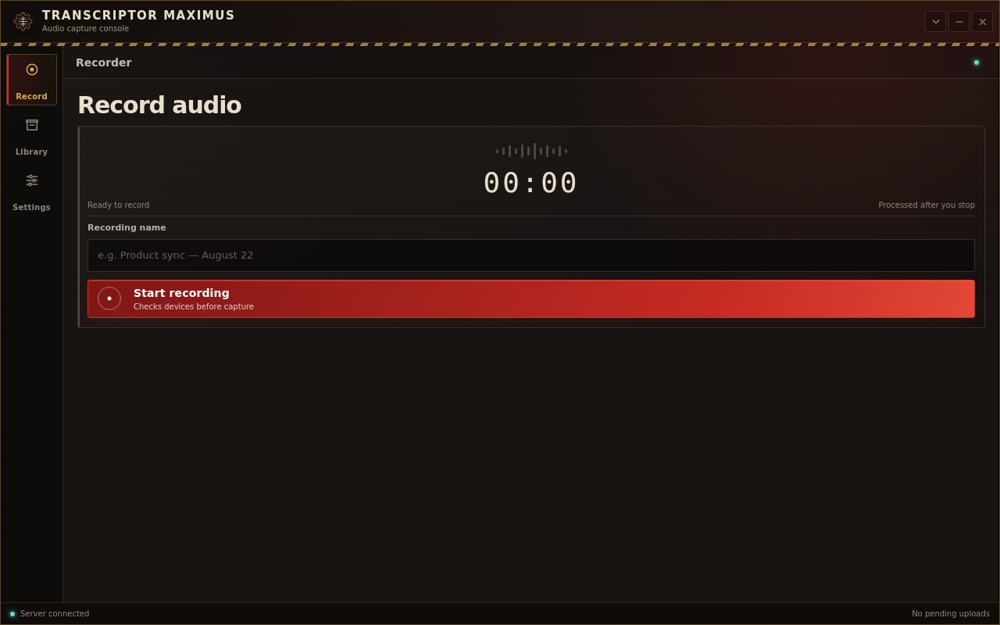
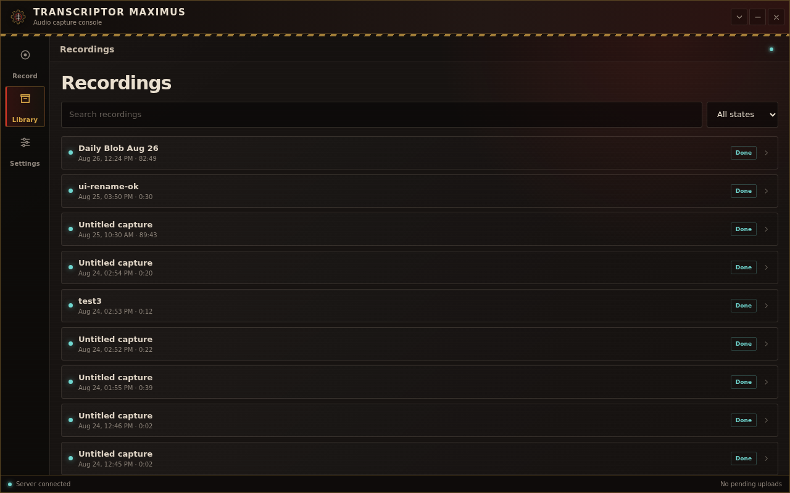
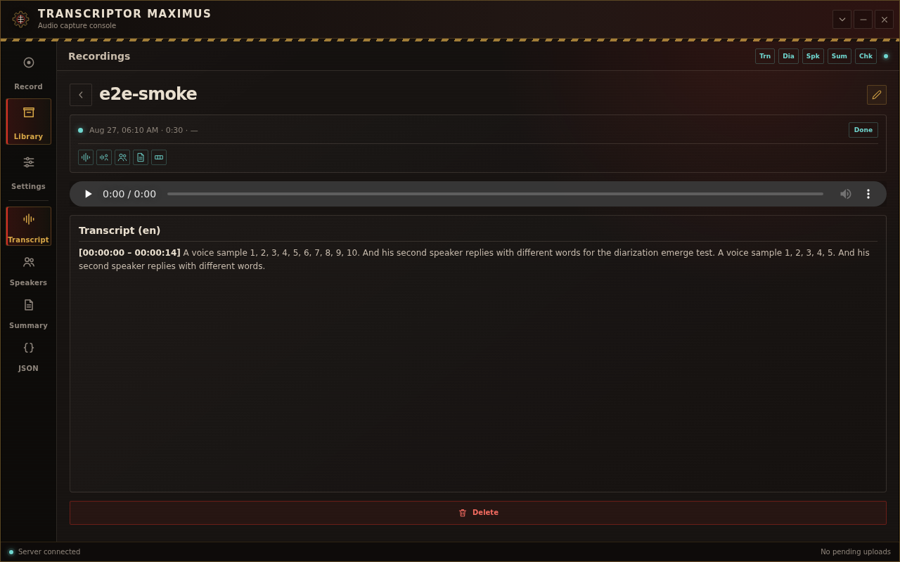

# 🎙️ Transcriptor Maximus

<p align="center">
  
</p>

Self-hosted call recorder with server-side ML: record meetings/calls on your
desktop, upload in the background, and get a **transcript with speaker labels
and a summary** — every stage re-runnable on demand.

```
┌──────────────────────────┐          ┌─────────────────────────────────────┐
│ Client (Tauri v2)        │  FLAC    │ Server (Docker Compose)             │
│ ┌──────────────────────┐ │  via     │ ┌────────┐  ┌────────────────────┐  │
│ │ mic + system audio   │─┼──PUT─────┼▶│  API   │─▶│ Temporal worker    │  │
│ │ FLAC encode          │ │ resumable│ │FastAPI │  │ transcribe         │  │
│ │ spool + retry        │ │ chunks   │ │ :8090  │  │ → diarize → merge  │  │
│ └──────────────────────┘ │          │ └────────┘  │ → summarize        │  │
│ SvelteKit UI             │          │             └────────────────────┘  │
                                      │ PostgreSQL · Temporal UI :8082      │
                                      │ NAS-backed recording storage        │
                                      └─────────────────────────────────────┘
```

## Highlights

- **Client is thin, server does the ML.** Capture + FLAC encode + upload on the
  desktop; transcription (faster-whisper), diarization (LinTO/pyannote) and
  summarization (any OpenAI-compatible API) run in Docker on your hardware.
- **Durable pipeline.** Temporal drives the five stages with per-stage retry
  and status; a crash or restart never loses a recording mid-processing.
- **Resumable uploads.** Audio is spooled locally, uploaded as offset-addressed
  chunks, verified by SHA-256 at finalize. A dropped Wi-Fi connection resumes
  where it left off — on the next app run, too.
- **Per-stage regenerate.** Not happy with the transcript or summary? Hit
  regenerate for that single stage; downstream stages re-run automatically.
- **FLAC everywhere.** Lossless transport and storage; PCM is captured
  disk-first, so recording survives even if encoding dies.
- **Pre-flight checks.** Permissions and device availability are checked on
  every record start; **Settings** runs a live RMS probe of both capture
  paths — no more silent empty first recordings.
- **Single-user by design.** One bearer token, LAN-oriented, zero accounts.
- **Tags & profiles.** Tag a recording (`pathfinder`, `meeting`…) and a yaml
  profile can override the summary prompt and name the exported artifact —
  RPG session logs, structured minutes, your own domain. Declarative only;
  the core pipeline never breaks on a bad profile.

## Screenshots

| Library | Recording detail |
| ------- | ---------------- |
|  |  |

## Hosting 100% locally

All ML runs on-box — no cloud account, no external API key, nothing leaves
your LAN. The **default configuration is the fully local one**:

```bash
cd server
cp config.example.yaml config.yaml     # defaults are already local
cp .env.example .env                   # set TRANSCRIPTER_TOKEN (openssl rand -hex 32)
docker compose up -d --profile diarization
```

All `docker compose` commands in this README run from `server/` — the
relative `./storage` bind and the `config.yaml` mount depend on it.

| Concern       | Local answer                                                        |
| ------------- | ------------------------------------------------------------------- |
| Transcription | faster-whisper `small` (int8 CPU) inside the worker container       |
| Diarization   | bundled LinTO container (`diarization` profile) — pyannote weights  |
|               | are baked into the image: no HuggingFace token, no runtime download |
| Summary       | off by default; optionally point at a local LLM server (below)      |
| Recordings    | `server/storage/recordings/` (bind mount — repoint at any dir)      |
| Notes         | `./storage/transcripts` unless `TRANSCRIPTS_DIR` is set             |
| Metadata      | postgres in the `pgdata` named volume                               |

**One-time downloads, then offline.** The first worker start pulls the
whisper weights (~0.5 GB for `small`) from huggingface.co into the `models`
named volume; container recreates keep them. After that the whole stack
works with no internet access. Never run `docker compose down -v` unless
you mean it — it deletes the whisper cache, the postgres database, and the
Speaches cache.

**Resources.** ~4 GB free RAM for the base stack (local whisper + LinTO).
The LinTO container takes ~2 min to load its weights on first start —
Temporal's diarize retry absorbs it, so an early recording's `diarize`
stage may simply wait. Enabling the bundled Speaches profile with a larger
model needs several GB more; check `docker stats`.

**Optional: local summarizer.** Any OpenAI-compatible chat endpoint on the
same host/LAN works — e.g. Ollama (`ollama pull qwen3:14b`, serves
`:11434`):

```yaml
# server/config.yaml
summarize:
  enabled: true
  model: qwen3:14b
  base_url: http://<ollama-host>:11434/v1   # LAN IP or host.docker.internal —
                                            # NOT localhost (worker is a container)
  api_key_env: ""                            # keyless endpoint: no auth header sent
```

`docker compose restart worker` to apply.

**Verify the install:** `cd server && bash scripts/e2e_smoke.sh` pushes a
synthetic two-speaker recording through upload → pipeline → artifacts;
green output means the whole local stack works.

**Client:** build on your desktop OS (see
[Building the client](#building-the-client-for-windows--macos)), then point
Settings at `http://<server-LAN-IP>:8090` + your token.

## Design language

The client uses a techno-religious industrial design language: compact machine
panels, square geometry, blackened iron surfaces, bone text, arterial red,
aged brass, and diagnostic cyan. Structure and state carry the theme; ornamental
fantasy styling does not. See [`DESIGN_GUIDELINES.md`](./DESIGN_GUIDELINES.md)
for the canonical palette, component rules, motion, accessibility, copy, and
review checklist.

## Pipeline

| Stage        | Engine                                   | Notes                                              |
| ------------ | ---------------------------------------- | -------------------------------------------------- |
| `chunk`      | ffmpeg segment cut (worker)              | optional (`chunk.enabled`); slices long audio into |
|              |                                          | ~10-min FLAC chunks + manifest so a whisper        |
|              |                                          | repetition loop poisons ≤1 chunk, not the recording |
| `transcribe` | faster-whisper (local) or OpenAI API     | model configurable, `small` by default             |
| `diarize`    | LinTO `linto-diarization-pyannote` (CPU) | optional (`enabled: false` → stage `skipped`)      |
| `merge_speakers` | IoU word↔segment matching           | fuses transcript words with speaker turns          |
| `summarize`  | OpenAI-compatible endpoint               | optional; stage reports `skipped` when no model    |
| `finalize`   | —                                        | always runs (even on stage failure) — unblocks UI |

Artifacts per recording: raw transcript, diarization turns, merged
speaker-attributed transcript, summary — all fetchable over the API and shown
in the client. The recording page renders the transcript, speakers, and summary
tabs as sanitized Markdown (allowlist-only tags, no links/images); the JSON tab
stays raw.
### Chunking (long recordings, CPU voice stacks)

A single multi-hour STT request can collapse into the whisper **repetition
loop** (one phrase repeated to the end of the file — observed on a 90-min
recording after 01:01). With `chunk.enabled: true` the worker first slices
the audio into ~10-minute chunks (2 s overlap, midpoint seam assignment —
no duplicated or lost speech at the cuts) and then transcribes/diarizes the
chunks **sequentially** (never in parallel: one CPU voice stack). Effects:

- a poisoned chunk costs ~10 min of transcript instead of hours;
- a failed chunk fails the stage with `chunk N of M` in `last_error`, and
  **regenerate resumes only the missing chunks** (per-chunk status lives in
  `meta/chunks/chunks.json`);
- a chunk whose segments are >50 % one identical phrase is marked `suspect`
  in the manifest; regenerating `transcribe` re-runs only suspect chunks
  with a reset decoder context (empty prompt +
  `condition_on_previous_text=false` where the STT server accepts it);
- chunk FLACs are deleted after `merge_speakers` (retention `until_merged`);
  re-running `transcribe`/`diarize` after that requires regenerating from
  the `chunk` stage;
- diarization speaker labels stay per-chunk (spk_0 in chunk 1 ≠ spk_0 in
  chunk 2) — merge attributes words by time overlap and is unaffected.

Off by default (`chunk.enabled: false` → stage reports `skipped`, pipeline
runs whole-file as before).

## Tags & profiles

Recordings carry flat lowercase **tags**: set them on the record page, edit
them on the recording page, search them via the library search box
(`GET /recordings?q=` matches title and tags).

**Profiles** are yaml files in `server/profiles/` (bind-mounted read-only at
`/etc/transcripter/profiles`, re-scanned on every stage run — no restart
needed). A profile whose `tags` intersect the recording's tags overrides the
summarize prompt and renames the exported summary artifact
(`output_artifact`, default `summary.md`; the canonical `meta/summary.md` is
unchanged). Tag edits on existing recordings apply on the next summarize
regenerate. Two examples ship in the repo (`pathfinder-party-log`,
`meeting-notes`); the format contract for writing your own is
`server/profiles/README.md`. A broken profile logs a warning and is skipped —
the pipeline is never affected.

## ML deployment matrix

ML services are compose **profiles**: the base stack needs none of them.

> **Upgrading from before profiles?** A plain `docker compose up -d` no
> longer starts the diarization container — it now lives behind the
> `diarization` profile. Add `--profile diarization` to your usual commands
> (recommended, config default `enabled: true` keeps working), or set
> `diarization.enabled: false` in config.yaml to run transcript-only.
> The worker logs a startup warning if diarization is enabled but its
> endpoint is unreachable.

| Mode                          | Transcribe                     | Diarization                          | How                                                        |
| ----------------------------- | ------------------------------ | ------------------------------------ | ---------------------------------------------------------- |
| Bundled, zero-config (default)| faster-whisper in worker       | LinTO behind profile                 | `docker compose up -d --profile diarization`               |
| No ML containers              | faster-whisper in worker       | disabled — stages `skipped`          | `docker compose up -d` + `diarization.enabled: false`      |
| Bundled Speaches              | Speaches behind profile `stt`  | LinTO behind profile                 | `docker compose --profile stt --profile diarization up -d` + config below |
| External / voice stack        | any OpenAI-compatible STT      | any LinTO endpoint                   | point config/env at `http://<host>:<port>` — see below     |

### Routing transcription to Speaches (bundled)

```bash
docker compose --profile stt --profile diarization up -d
```

```yaml
# server/config.yaml
transcribe:
  backend: api
  model: Systran/faster-whisper-small   # full HF id; plain "small" 404s
  base_url: http://speaches:8000/v1     # the /v1 suffix is REQUIRED
  api_key_env: ""                       # local speaches needs no key
```

Then `docker compose restart worker` (config is read once at startup).
Speaches preloads `Systran/faster-whisper-small` at startup — the first
start downloads weights from huggingface.co into the `speaches-hf-cache`
volume (later starts work offline).

### External voice stack (separate compose / host)

Architecture deep-dive for this mode (components, data flow, failure
semantics): [docs/backend-architecture.md](./docs/backend-architecture.md).

The worker reaches any reachable endpoint; env beats config:

```bash
# .env next to docker-compose.yml
DIARIZATION_ENDPOINT=http://<voice-host>:8070
```

For transcription set `transcribe.base_url` to `http://<host>:8000/v1`.
Same-host separate stacks can instead share a docker network
(`docker network create voice`, uncomment the `voice` block in
`docker-compose.yml`) and use service DNS names directly.

Working example — a LAN-hosted platform speaches (bearer auth, CPU,
accuracy-tuned):

```yaml
# config.yaml
transcribe:
  backend: api
  model: Systran/faster-whisper-large-v3   # or deepdml/faster-whisper-large-v3-turbo-ct2
  base_url: http://<stt-host>:8000/v1
  api_key_env: SPEACHES_API_KEY
```

```bash
# .env next to docker-compose.yml (compose passes it to the worker;
# docker compose up -d worker to apply — restart alone keeps old env)
SPEACHES_API_KEY=<key from 1Password, vault Secrets>
```

Word timestamps (`timestamp_granularities[]=word`) are what the diarization
merge keys off — the endpoint MUST return them (platform speaches does;
a LiteLLM hop in front of it currently drops the parameter, avoid proxying).

Verify with `STT=speaches bash server/scripts/e2e_smoke.sh` — it asserts
non-empty word timestamps end-to-end. Image updates go through
[SECURITY.md](./SECURITY.md) (pinned tags, pre-update checklist).

## Server setup

Requirements: Docker + Docker Compose plugin, ~4 GB free RAM for models.

```bash
cd server
cp config.example.yaml config.yaml        # optional: tune models/storage
echo 'TRANSCRIPTER_TOKEN=<your-secret>' > .env
docker compose up -d --profile diarization
```

| Service      | URL                        | Purpose                     |
| ------------ | -------------------------- | --------------------------- |
| API          | `http://localhost:8090`    | REST + health at `/health`  |
| Temporal UI  | `http://localhost:8082`    | pipeline observability      |
| Speaches     | internal (opt-in profile)  | OpenAI-compatible STT       |
| Diarization  | host `:8070` (container `:80`) | LinTO HTTP service     |

Recordings land in `server/storage/recordings/<uuid>/` — point the compose
bind-mount at your NAS/export path to store elsewhere.

### Configuration (`server/config.yaml`)

```yaml
transcribe:
  backend: local          # local (faster-whisper) or api (OpenAI-compatible)
  model: small            # whisper model / API model id (HF id for speaches)
  base_url: ""            # when backend=api — MUST include /v1
  api_key_env: ""         # ENV VAR NAME holding the key (never the key itself)

summarize:
  enabled: false          # true once model+base_url are set; stage
                        # reports `skipped` while unconfigured
  model: ""               # any OpenAI-compatible chat model id
  base_url: ""            # MUST include /v1 (dev stack: LiteLLM proxy at
                        # http://192.168.3.23:4000/v1, qwen3.8-27b-q4_k_m)
  api_key_env: ""         # env var NAME (dev stack: LITELLM_API_KEY in .env —
                        # a LiteLLM virtual key scoped to that model)

diarization:
  enabled: true           # false → diarize/merge skipped, no container needed
  endpoint: http://diarization:80
```

Storage path, DB URL, and ports live in the same file / `docker-compose.yml`.
The worker reads config once — `docker compose restart worker` to apply.

### Transcript note export (Obsidian-friendly)

Every finished recording is exported as ONE folder
`{YYYY-MM-DD_HH-MM} {title|call} {id8}/` containing the meta artifacts 1:1 —
`transcript.md`, `diarized-transcript.md`, `summary.md` (only those that
exist) — each with its own YAML frontmatter (`recording_id`, `title`,
`created`, `date`, `tags`, optional `duration_sec`). The host directory is
chosen in `.env`, not yaml:

```bash
# .env next to docker-compose.yml — the dir MUST exist before `up`
TRANSCRIPTS_DIR=/mnt/your-nas/vault/Transcripts
```

Unset → `./storage/transcripts`. Folder names are UTC; `TRANSCRIPTER_TZ` env
overrides. **Regenerate rewrites the artifact files in place** (atomic
tmp+rename, one hidden `.{name}.lock` fence per file; Obsidian hides
dotfiles), while **renaming a recording renames the folder in place** — your
edits and extra files inside the folder survive both. Artifacts that
disappear from meta (e.g. diarization disabled) are mirror-deleted from the
folder; files the exporter doesn't own are never touched. Old flat
`* {id8}.md` notes from the pre-folder scheme are migrated (deleted) on the
next export of that recording.

Optional boot-race guard in `config.yaml`:

```yaml
transcripts:
  sentinel: ".transcripter"  # marker file you create INSIDE the transcripts
                             # dir (touch "$TRANSCRIPTS_DIR/.transcripter");
                             # export refuses to run unless it exists —
                             # catches a bind over an empty NAS mountpoint
                             # (docker started before the mount)
```

- **Export is best-effort.** A dead NAS mount can't hang the pipeline: the
  export runs in a subprocess (20 s kill-and-abandon, max 4 live children);
  failures land in the workflow result (`transcript_note`) in Temporal UI.
- **Recovery:** `docker compose exec worker sh -c 'cd /app/worker &&
  .venv/bin/python -m worker.backfill'` re-exports every `done` recording
  (idempotent, same subprocess isolation, refuses on a missing sentinel).
- **Keep the NAS mount hard** (default): the export subprocess is killed after
  20 s, so a hung NAS can't stall the pipeline, and atomic tmp+rename can't
  truncate an existing note. Soft mounts trade that for faster EIO on a dead
  server — not worth it for a personal vault.
  Consider a systemd drop-in `RequiresMountsFor=/mnt/your-nas` on the docker
  unit so binds never capture an empty mountpoint.
- Renaming a recording (`PATCH /recordings/{id}`) renames its vault folder
  in place (`os.rename`) and does NOT rewrite the files inside — your edits
  survive (the frontmatter `title` goes stale until the next regenerate) —
  fire-and-forget: the rename stands even if Temporal is down
  (`worker.backfill` is the recovery path).
- Deleting a recording does NOT delete its folder (the `recording_id` in
  each file's frontmatter is the hook for a future cleanup).
- Workflow deploy note: the export activity was added to the workflow
  `finally` — deploy when no `ProcessRecording` executions are open and the
  worker isn't restart-looping (in-flight workflows replay against the new
  command sequence).

## Client setup

Requirements: Node 22+, pnpm, Rust toolchain, platform webkit deps
(see [tauri prerequisites](https://v2.tauri.app/start/prerequisites/)).

```bash
cd client
pnpm install
pnpm tauri dev     # desktop app window
```

In-app **Settings**: enter the server URL (`http://<server-host>:8090`) and the
token from your `.env`, then select **Test and save connection** once. Saved
credentials are checked automatically on later launches. Device selection
also lives in **Settings**: pick the microphone and system output there —
select **Off** for system audio when a microphone-only recording is
intended. On **Record**, **Start recording** opens both capture paths; the
microphone is authoritative — if it fails or stalls, the recording stops
with an error. System audio is a bonus source: a tap that fails to open
blocks the start, but one that delivers no frames within 10 s (no audio
flowing, slow aggregate spin-up) degrades the recording to microphone-only
with a live warning in the UI instead of killing it.

## API

All endpoints require `Authorization: Bearer <token>` (except `/health`).

| Method | Path                                                 | Purpose                                  |
| ------ | ---------------------------------------------------- | ---------------------------------------- |
| POST   | `/recordings`                                        | register recording (returns uuid)        |
| PUT    | `/recordings/{id}/audio?offset=N`                    | upload chunk (≤16 MB), resumable         |
| POST   | `/recordings/{id}/finalize`                          | SHA-256 check → start pipeline           |
| GET    | `/recordings` / `/recordings/{id}`                   | paginated list (`?limit=&offset=&q=&state=`) / detail      |
| PATCH  | `/recordings/{id}`                                   | rename (trims title) + re-export note    |
| DELETE | `/recordings/{id}`                                   | delete recording + stored audio (204)    |
| POST   | `/recordings/{id}/regenerate`                        | `{"stage": "transcribe"}` → rerun chain  |
| GET    | `/recordings/{id}/artifacts/{stage}[?file=…]`        | stage artifacts (transcript, diarization, …) |
| GET    | `/recordings/{id}/summary`                           | latest summary artifact                  |
|GET/HEAD| `/recordings/{id}/audio`                             | download the FLAC (HTTP Range supported) |
| GET    | `/settings`                                          | effective config (secrets masked)        |

Quick check:

```bash
# returns {"items":[…],"total":N,"limit":50,"offset":0}
curl -s -H "Authorization: Bearer $TRANSCRIPTER_TOKEN" http://localhost:8090/recordings
```

## End-to-end smoke test

```bash
cd server && bash scripts/e2e_smoke.sh
```

Generates a synthetic two-speaker FLAC, uploads it **with a simulated
connection drop and resume**, verifies byte-identity via SHA-256, waits for
the pipeline, and checks all stage artifacts. Green output = the whole stack
works.

## Development

### Skills for coding agents

Beyond the transcripter-specific skills (`.claude/skills/transcripter-*`,
symlinked from `skills/`), two vendored Temporal skills give agents accurate,
up-to-date Temporal knowledge instead of relying on stale training data:

- `skills/temporal-developer` — Python-SDK subset of
  [skill-temporal-developer](https://github.com/temporalio/skill-temporal-developer)
  @ `b01c632`: determinism, patterns, gotchas, versioning, testing, CLI
  workflow commands. Curated for this repo (core + python references only).
- `skills/temporal-ops` — self-hosted subset of
  [skill-temporal-ops](https://github.com/temporalio/skill-temporal-ops) @
  `c2f7602`: `temporal operator`/data-plane CLI, stuck-workflow and
  worker-health triage, non-determinism remediation. Cloud/`tcld` references
  removed; SKILL.md pins the repo access pattern (`docker compose exec
  temporal temporal --address temporal:7233 …` from `server/`).

Each skill's SKILL.md records the vendored commit; check upstream for updates
before syncing. Fresh official docs are fetchable as Markdown by appending
`.md` to any docs.temporal.io URL (index: `docs.temporal.io/llms.txt`).


- Server API tests: `cd server/api && uv run pytest`
- Worker tests: `cd server/worker && uv run pytest`
- Client tests: `cd client/src-tauri && cargo test`
- Lint: `uvx ruff check .` / `uvx pyright` (server), `cargo clippy -- -D warnings` (client)

## Building the client for Windows / macOS

Cross-compiling a Tauri app from Linux is not supported — build **on the
target OS**. Prerequisites on both: [Node 22+](https://nodejs.org),
[pnpm](https://pnpm.io), and a [Rust toolchain](https://rustup.rs)
(`rustup default stable`).

**Windows** (Windows 10/11, x64):

```powershell
# one-time: VS Build Tools 2022 (Desktop development with C++)
winget install Microsoft.VisualStudio.2022.BuildTools --override "--add Microsoft.VisualStudio.Workload.VCTools --includeRecommended"
# clone + build
git clone https://github.com/megastruktur/transcripter && cd transcripter\client
pnpm install
pnpm tauri build            # bundles appear in src-tauri\target\release\bundle\
```

Installers land in `bundle\nsis\*.exe` (recommended) and `bundle\msi\*.msi`.
For a quick test without installing: run
`src-tauri\target\release\transcriptor-maximus.exe`.

**macOS** (12+, Xcode Command Line Tools: `xcode-select --install`):

```bash
git clone https://github.com/megastruktur/transcripter && cd transcripter/client
pnpm install
pnpm tauri build            # bundle/macos/*.app + bundle/dmg/*.dmg
```

Note: the `.app`/`.dmg` is unsigned and not notarized. On macOS Sequoia+ a
downloaded copy reports *"damaged and can't be opened"* with no **Open
Anyway** option — clear the quarantine attribute once after install:
`xattr -cr "/Applications/Transcriptor Maximus.app"`. Permanent fix:
[sign and notarize it yourself](https://v2.tauri.app/distribute/sign/macos/).

**First run after install:** Settings → Server URL
`http://<server-LAN-IP>:8090` + your `TRANSCRIPTER_TOKEN`. Windows Firewall
will prompt on first upload — allow it. macOS 14.2+ prompts separately for
Microphone and System Audio Recording access; grant both when system audio is
enabled.

**Platform capture verification:** on macOS, test both an output-only device and
a duplex USB/headset output. On Windows 10 1703+ or Windows 11, select a render
endpoint and play non-DRM audio while recording. In both cases, speak a separate
microphone marker and confirm both markers exist in the saved FLAC/transcript.

## Scope & limitations (MVP)

- Single user, bearer token; no TLS termination in the compose stack — put it
  behind a reverse proxy (e.g. Traefik/Caddy) if you expose it beyond LAN.
- Audio playback in the browser passes the bearer token as a `?token=` query
  param so `<audio>` elements can authenticate; that URL can appear in
  proxy/server access logs — an accepted single-user LAN tradeoff.
- System audio uses a Core Audio process tap on macOS 14.2+ and WASAPI shared-mode
  loopback on Windows 10 1703+/Windows 11. Linux remains microphone-only.
- Windows may exclude DRM/protected playback from loopback capture. This is an OS
  restriction, not an application fallback.
- The Rust uploader speaks plain HTTP (LAN). TLS support tracks a toolchain
  upgrade — see project memory notes.

## License

MIT
