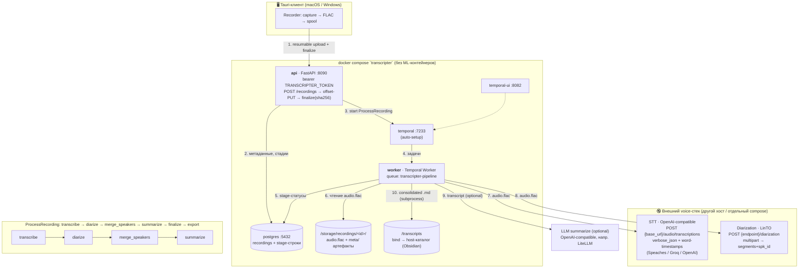

# Backend architecture — external STT + diarization

Architecture of the server stack when transcription and diarization are served
by **third-party/external services** instead of the bundled ML containers
(compose profiles `stt` / `diarization` not started). This is a supported
configuration: `transcribe.backend=api` + an external `diarization.endpoint`
(see «ML deployment matrix» in the root README).



## Поток данных

1. **Загрузка.** Клиент грузит FLAC только до API (resumable offset-PUT чанков
   ≤16 МБ + finalize с SHA-256). Внешние STT/diarization-сервисы никогда не
   видят клиента — worker сам отправляет им файл с диска (`/storage`).
2. **Запуск пайплайна.** API после `finalize` стартует workflow
   `ProcessRecording` в Temporal и дальше только отдаёт статусы стадий из
   Postgres.
3. **Стадии.** Worker выполняет активности по порядку:
   `transcribe → diarize → merge_speakers → summarize`, затем всегда
   `finalize_recording` (ставит терминальный статус записи) и best-effort
   `export_transcript` (консолидированная заметка .md в `/transcripts`).
4. **Внешние вызовы.** `transcribe` при `backend=api` делает
   `POST {base_url}/audio/transcriptions` (multipart, `verbose_json`,
   `timestamp_granularities[]=word` — word-timestamps обязательны, по ним
   работает merge). `diarize` шлёт файл на `POST {endpoint}/diarization`
   (LinTO-формат `seg_begin/seg_end/spk_id` транслируется в
   `start/end/speaker` на этой границе).
5. **Regenerate.** `POST /recordings/{id}/regenerate {stage}` перезапускает
   workflow с выбранной стадии; все нижестоящие стадии выполняются заново.

## Конфигурация внешнего режима

`server/config.yaml` + `.env`:

```yaml
transcribe:
  backend: api
  model: Systran/faster-whisper-small   # полный HF-id; пустые имена 404
  base_url: http://<stt-host>:8000/v1   # суффикс /v1 ОБЯЗАТЕЛЕН
  api_key_env: SPEACHES_API_KEY         # ИМЯ env-переменной, не сам ключ

diarization:
  enabled: true
  endpoint: http://<diar-host>:80       # или env DIARIZATION_ENDPOINT
```

- Env перекрывает yaml: `DIARIZATION_ENDPOINT` (endpoint), `SPEACHES_API_KEY`
  (значение ключа), `TRANSCRIPTER_TOKEN`, `TRANSCRIPTS_DIR`.
- Worker читает конфиг один раз при старте → после изменений
  `docker compose restart worker`; смена env из `.env` требует
  `docker compose up -d worker`.
- При `backend=api` worker не прелоадит whisper → volume `models` не нужен,
  контейнер лёгкий, CPU-only.

## Отличия от bundled-режима

- Профили `stt` / `diarization` не поднимаются; порты 8070 (LinTO) и 8000
  (Speaches) в этом стеке не публикуются.
- ML-сервисы живут где угодно: другой хост в LAN, отдельный compose-стек,
  облачный API. Требования к STT — OpenAI-совместимость + word-timestamps;
  к diarization — HTTP-API LinTO.
- Оба стека на одном docker-хосте могут делить внешнюю сеть `voice`
  (`docker network create voice`, раскомментировать блок `networks:` в
  `docker-compose.yml`) и адресоваться по DNS-именам сервисов.

## Отказоустойчивость (workflows.py)

- **transcribe** — retry ×2, `StartToCloseTimeout` растёт от длительности
  аудио (`timeout_for`: base + 30·мин + холодный старт 120 с).
- **diarize** — best-effort: retry ×4 c интервалом 30–60 с (поглощает
  холодный старт внешнего сервиса); при исчерпании ретраев запись остаётся
  годной — transcript-only, стадия помечается `failed` + `last_error` для UI.
- **export** — изолированный subprocess (20 с kill-and-abandon, ≤4 живых
  дочерних процесса), всегда best-effort; восстановление — `worker.backfill`.
- Сторонний сервис, лежащий дольше ретраев, валит только свою стадию, а не
  весь стек. `finalize_recording` ставит терминальный статус записи даже при
  упавшей стадии.
